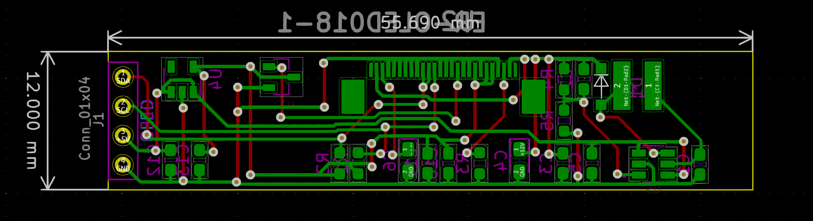

# SSD1326 256x32 oled breakout

## Features / requirements?
* 5V+ in
* I2C
* Voltage regulator V3.3 out for logic
* Step up to 12V+ to power oled panel
* For use with ER-OLED01B-1 w/26 pin Ziff connector

## Included
* `datasheet` folder includes datasheets for everything used here as well as ones I abandoned
* `onigaku` repo (not included in this repo) has all symbols and footprints are available

## Credited inspiration
* Adafruit schematics for latest SSD1306 breakout boards
* https://hackaday.io/project/173753-oled-breakout-board-with-dc-dc-step-up/details
